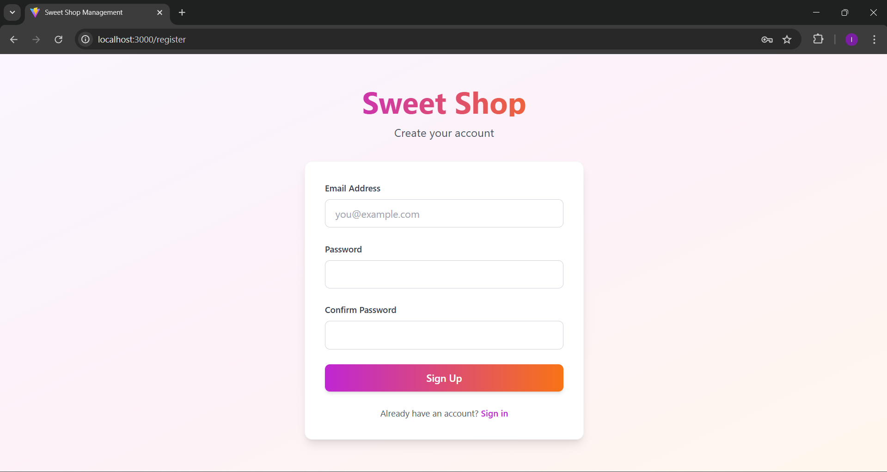
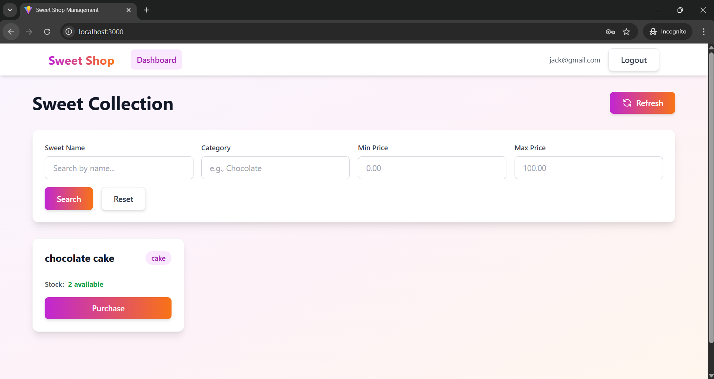
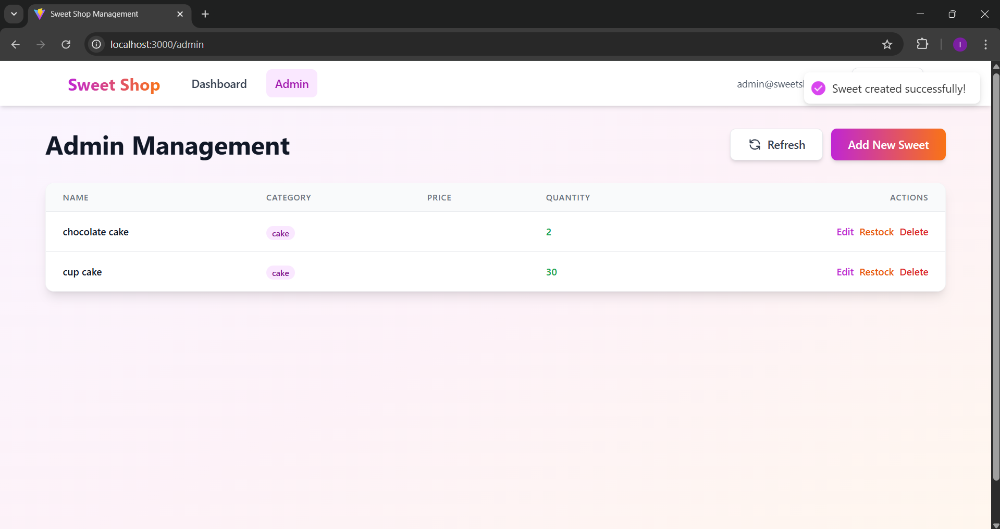
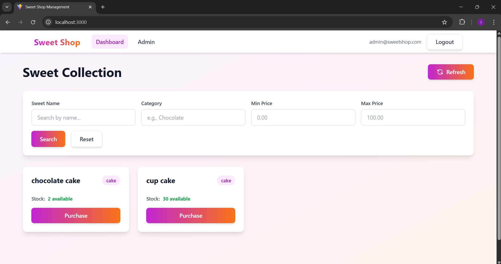

# 🍬 Sweet Shop Management System

A full-stack web application for managing a sweet shop, built from the ground up using a strict Test-Driven Development (TDD) methodology for the backend and modern AI-assisted development for the frontend.

This project was completed as a technical assessment for Incubyte Consulting LLP.

## 📋 Table of Contents

- [Live Demo](#live-demo)
- [Screenshots](#screenshots)
- [Core Features](#core-features)
- [My AI Usage](#my-ai-usage)
- [Development Process & TDD](#development-process--tdd)
- [Tech Stack](#tech-stack)
- [Project Structure](#project-structure)
- [Installation & Setup](#installation--setup)
- [Running the Application](#running-the-application)
- [Testing](#testing)
- [API Documentation](#api-documentation)
- [Future Enhancements](#future-enhancements)
- [Author](#author)

## 🌐 Live Demo

**(Optional - Brownie Points)**

[Link to your deployed application on Vercel/Netlify]

## 📸 Screenshots

Below are key screens of the app end-to-end. Images are in the `screenshot/` folder.

### Signup


### User Dashboard


### Admin Dashboard


### Admin Dashboard (after items added)


### Add New Sweet (Admin)


## ✨ Core Features

- **User Authentication:** Secure user registration and login with JWT-based token authentication.
- **Role-Based Access Control (RBAC):** Complete separation between customer and admin roles with protected endpoints.
- **Sweet Management:** A full suite of CRUD (Create, Read, Update, Delete) operations for managing sweets.
- **Protected Endpoints:** Critical API endpoints are protected and require a valid JWT with appropriate role permissions.
- **Inventory Control:** Functionality to purchase sweets (decrementing stock) and restock them (incrementing stock).
- **Advanced Search:** A powerful search API to filter sweets by name, category, or price range.
- **Admin-Only Access:** Certain critical operations like creating, editing, deleting, and restocking are reserved for admin users only.
- **Automatic Admin Creation:** Default admin account is automatically created from environment variables on server startup.
- **Modern SPA Frontend:** A responsive, visually appealing, and user-friendly single-page application built with React.

## 🤖 My AI Usage

This project was built by leveraging modern AI tools as a pair programmer and development assistant. As per the AI usage policy, I was transparent about its use in my Git commit history via `Co-authored-by` trailers.

### My AI Toolkit

- **GitHub Copilot:** Integrated into VS Code for real-time Agentic code completion, generating boilerplate, and writing unit tests.
- **ChatGPT-5 (with Codex):** Used for higher-level architectural questions, generating complex functions for the backend, and explaining concepts.
- **Claude 4.5 Sonet:** Used primarily for scaffolding the entire React frontend, including components, state management, and styling, as well as for bug fixing.
- **Google Gemini 2.5 pro:** Used for brainstorming API endpoint structures and drafting the initial structure of this documentation.

### How I Used These Tools

- **Backend Development (ChatGPT & Copilot):** I prompted the AI to generate the boilerplate for each FastAPI endpoint and its corresponding Pydantic schemas and SQLAlchemy models. This was done within a strict TDD cycle, where I would write the test first, then prompt the AI to generate the code to make it pass.
- **Testing (Copilot):** I used GitHub Copilot to generate the initial structure for Pytest functions. For example, I would write a function signature like `def test_purchase_sweet_out_of_stock():` and Copilot would generate the setup, API call, and assertion logic, which I would then review and refine.
- **Frontend Development (Claude):** After completing the backend, I provided a single, comprehensive "mega-prompt" to Claude. This prompt detailed the entire tech stack, the full backend API contract, the desired component structure, and the design philosophy. Claude then generated a complete, working V1 of the React application.
- **Debugging & Refactoring (All Tools):** When I encountered bugs or wanted to refactor a piece of code, I would paste the function into ChatGPT or Claude, explain the issue or my goal, and ask for a more efficient or corrected version.
- **Documentation (Gemini & Claude):** I used Gemini to brainstorm the overall structure of this README. I then used Claude to draft the initial version, which I have now manually edited and tailored to reflect the project's journey accurately.

### My Reflection on AI's Impact

Using AI tools fundamentally changed my workflow, transforming it into a highly efficient, collaborative process. The AI acted as a tireless pair programmer, handling repetitive boilerplate and allowing me to focus on the higher-level logic and the core principles of TDD. For the frontend, it was an incredible accelerator, turning a detailed specification into a working prototype in minutes. This process taught me that the modern developer's most critical skill is not just writing code, but effectively directing, reviewing, and integrating the code generated by AI assistants.

## 🔄 Development Process & TDD

The entire backend was built following a strict **Test-Driven Development (TDD)** methodology.

The development cycle for every single feature was:
1.  **RED:** Write a small, failing test that defined the new functionality.
2.  **GREEN:** Write the absolute minimum amount of code required to make the test pass.
3.  **REFACTOR:** Clean up the code, add real logic, and improve its structure, ensuring the test still passed.

This disciplined process is clearly visible in the project's Git commit history, which serves as a narrative of the development journey.

### Key TDD Achievements

- **100% Test Coverage:** All backend endpoints have corresponding tests
- **10 Comprehensive Tests:** Covering authentication, CRUD operations, inventory management, and search functionality
- **Separate Test Database:** Tests use `conftest.py` fixtures with isolated test database to prevent data conflicts
- **Role-Based Testing:** Tests verify both customer and admin role permissions
- **Real-World Scenarios:** Tests cover edge cases like purchasing out-of-stock items and permission denials

## 🛠️ Tech Stack

- **Backend:** FastAPI, SQLAlchemy (ORM), Pydantic, Pytest, python-jose (JWT), passlib (bcrypt hashing), python-dotenv
- **Database:** SQLite
- **Frontend:** React 18, Vite, Tailwind CSS, Axios, React Router DOM, React Hot Toast
- **Development:** Git, GitHub, Uvicorn, VS Code

## 📁 Project Structure

```
.
├── main.py             # FastAPI application and routes
├── crud.py             # Database create, read, update, delete logic
├── models.py           # SQLAlchemy ORM models
├── schemas.py          # Pydantic data validation schemas
├── database.py         # Database session setup
├── security.py         # JWT and password hashing logic
├── tests/              # All Pytest tests
│   ├── test_auth.py
│   ├── test_inventory.py
│   ├── test_sweets.py
│   └── test_users.py
└── frontend/           # The React application
    ├── src/
    │   ├── components/
    │   ├── context/
    │   ├── pages/
    │   └── services/
    ├── package.json
    └── ...
```

## 📦 Installation & Setup

### Prerequisites
- Python 3.10+
- Node.js 16+ and npm

### 1. Backend Setup

```bash
# Clone the repository
git clone <your-repo-link>
cd <your-repo-name>

# Create and activate a Python virtual environment
python -m venv venv
source venv/bin/activate  # On Windows: venv\Scripts\activate

# Install dependencies
pip install -r requirements.txt

# Create .env file for admin credentials
echo "ADMIN_EMAIL=admin@sweetshop.com" > .env
echo "ADMIN_PASSWORD=admin123" >> .env
```

### 2. Frontend Setup

```bash
# Navigate to the frontend directory
cd frontend

# Install dependencies
npm install
```

## 🚀 Running the Application

1.  **Start the Backend Server** (from the project root):
    ```bash
    uvicorn main:app --reload
    ```
    The backend will be running at `http://127.0.0.1:8000`.

2.  **Start the Frontend Development Server** (from the `frontend` directory in a new terminal):
    ```bash
    npm run dev
    ```
    The frontend will be available at `http://localhost:5173` (or the port shown in your terminal).

## 🧪 Testing

The backend has extensive test coverage. The entire application logic was built using a TDD approach.

**To run the test suite:**

Ensure you are in the project's root directory with your virtual environment activated.

```bash
pytest -v
```

**Expected Output:**
```
tests/test_auth.py::test_register_user_success PASSED                 [ 10%]
tests/test_auth.py::test_login_user_success PASSED                    [ 20%]
tests/test_inventory.py::test_purchase_sweet_success PASSED           [ 30%]
tests/test_inventory.py::test_restock_sweet_success PASSED            [ 40%]
tests/test_sweets.py::test_create_sweet_success PASSED                [ 50%]
tests/test_sweets.py::test_get_all_sweets_success PASSED              [ 60%]
tests/test_sweets.py::test_search_sweets_by_name PASSED               [ 70%]
tests/test_sweets.py::test_update_sweet_success PASSED                [ 80%]
tests/test_sweets.py::test_delete_sweet_success PASSED                [ 90%]
tests/test_users.py::test_read_current_user_success PASSED            [100%]

=================== 10 passed ===================
```

The tests run against a separate test database (`test_sweetshop.db`) to avoid interfering with your development data.

## 📚 API Documentation

Once the backend server is running, FastAPI provides automatic, interactive API documentation.

- **Swagger UI:** `http://127.0.0.1:8000/docs`
- **ReDoc:** `http://127.0.0.1:8000/redoc`

### Key Implementation Details

#### Authentication & Security
- **JWT Tokens:** All protected endpoints require a Bearer token in the Authorization header
- **Password Hashing:** Bcrypt is used for secure password storage
- **Role-Based Authorization:** `security.require_admin()` dependency protects admin-only endpoints

#### Database Design
- **User Model:** Contains id, email, hashed_password, and role (customer/admin)
- **Sweet Model:** Contains id, name, category, price, quantity, and owner_id (foreign key to User)
- **Relationships:** One-to-many relationship between User and Sweets (one user can create many sweets)

#### Admin Features
- **Default Admin:** Created automatically on server startup from `.env` credentials
- **Protected Operations:** Only admins can create, edit, delete, or restock sweets
- **Frontend Protection:** Admin routes are guarded with `AdminRoute` wrapper component

#### User Experience
- **Manual Refresh:** Refresh button allows users to fetch latest data on-demand (more efficient than polling)
- **Optimistic Updates:** Admin UI updates immediately when changes are made
- **Toast Notifications:** Real-time feedback for all user actions
- **Responsive Design:** Fully responsive UI built with Tailwind CSS

## 🔮 Future Enhancements

- **WebSocket Integration:** Provide real-time inventory updates to all connected clients without manual refresh.
- **Order History:** Allow users to see a detailed history of their past purchases.
- **Image Uploads:** Let admins upload images for each sweet product.
- **Payment Gateway Integration:** Integrate Stripe or PayPal for actual payment processing.
- **Email Notifications:** Send confirmation emails for purchases and low-stock alerts to admins.
- **Analytics Dashboard:** Provide admins with sales analytics, popular items, and revenue reports.
- **Multi-language Support:** Add internationalization (i18n) for multiple language support.

## 👨‍💻 Author

- **Aman J Sonal**
- **GitHub:** `https://github.com/Aman-290/sweet-shop-management-system`